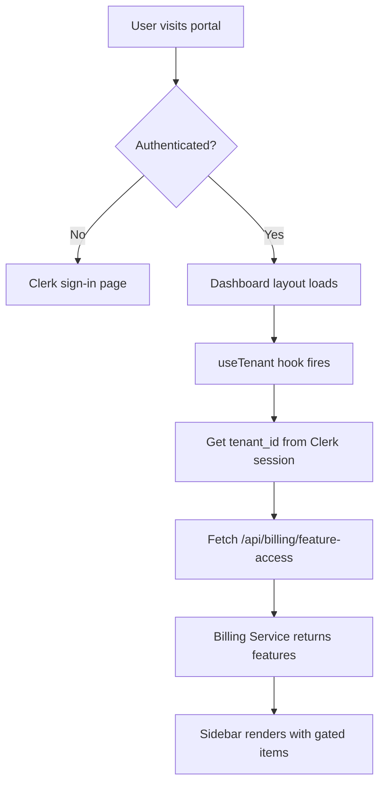
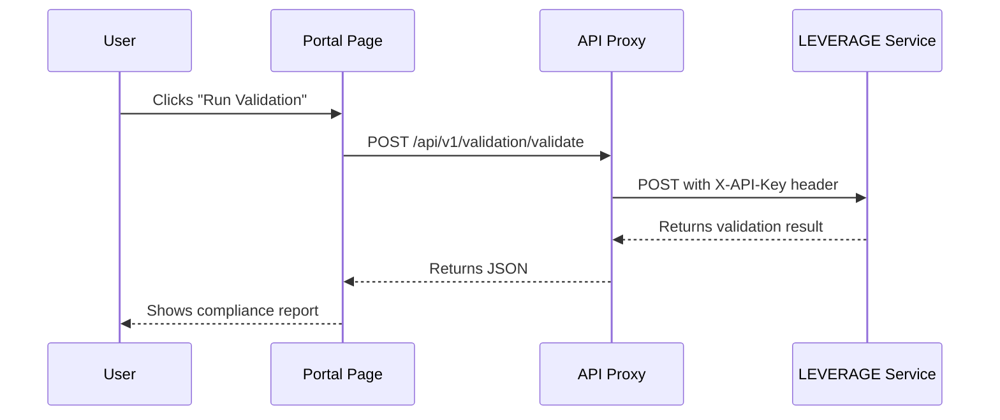
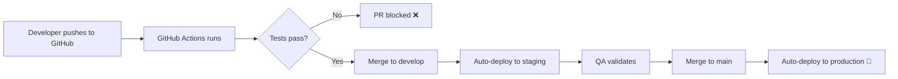

# TrueVow Customer Portal — Developer Onboarding Guide

**For:** Entry-level software developers joining the project  
**Purpose:** Complete understanding of architecture, integrations, use cases, edge cases, and production troubleshooting  
**Last Updated:** March 6, 2026

---

## Table of Contents

1. [System Overview](#1-system-overview)
2. [Architecture & Tech Stack](#2-architecture--tech-stack)
3. [Service Dependencies](#3-service-dependencies)
4. [Codebase Structure](#4-codebase-structure)
5. [Key Features & Use Cases](#5-key-features--use-cases)
6. [Data Flow & Integrations](#6-data-flow--integrations)
7. [Authentication & Authorization](#7-authentication--authorization)
8. [Feature Gating System](#8-feature-gating-system)
9. [Environment Configuration](#9-environment-configuration)
10. [Common Edge Cases](#10-common-edge-cases)
11. [Debugging & Troubleshooting](#11-debugging--troubleshooting)
12. [Production Support Playbook](#12-production-support-playbook)
13. [Development Workflow](#13-development-workflow)
14. [Testing Strategy](#14-testing-strategy)
15. [Deployment Pipeline](#15-deployment-pipeline)

---

## 1. System Overview

### What is TrueVow Customer Portal?

TrueVow Customer Portal is a **Next.js-based aggregation layer** that provides law firm attorneys with a unified dashboard to access multiple microservices:

- **INTAKE** — Lead management pipeline (Benjamin AI intake engine)
- **LEVERAGE** — Document compliance validation & deadline calculator
- **SETTLE** — Settlement intelligence database
- **Billing & Usage** — Subscription management, feature access control
- **VERIFY** — Certificate verification system
- **Team Management** — Staff invitations and permissions

### Key Design Principles

1. **Aggregation Layer Only** — The portal contains NO business logic. All data comes from backend microservices via API calls.
2. **Server-Side Proxy Pattern** — All API calls go through Next.js API routes (`/api/*`) to avoid CORS and keep API keys server-side.
3. **Feature-Gated UI** — Sidebar items show/hide based on tenant's subscription tier (fetched from Billing Service).
4. **Clerk Authentication** — Multi-tenant auth with `tenant_id` and `user_id` passed to all backend calls.

### What Runs Where?

| Component | Port | Purpose |
|-----------|------|---------|
| **Customer Portal** | 3031 | This Next.js app (frontend + API proxy) |
| **Billing Service** | 3016 | Feature flags, subscription tiers, usage tracking |
| **Intake Engine** | varies | Benjamin AI lead processing |
| **LEVERAGE Service** | varies | Document validation, deadline calc |
| **SETTLE Service** | varies | Settlement database queries |

**Important:** The portal NEVER directly calls external services from the browser. Always goes through `/api/*` proxy routes.

---

## 2. Architecture & Tech Stack

### Frontend Stack

```json
{
  "framework": "Next.js 14.2.35 (App Router)",
  "language": "TypeScript 5.x",
  "styling": "TailwindCSS 3.x + CSS custom properties",
  "state": "React hooks (useState, useEffect, useContext)",
  "auth": "Clerk (@clerk/nextjs)",
  "charts": "Recharts",
  "icons": "Lucide React"
}
```

### Backend Integration Pattern

```typescript
// Browser component
const { data } = await fetch('/api/billing/feature-access', { 
  method: 'GET' 
});

// Next.js API route (/api/billing/feature-access/route.ts)
export async function GET(request: NextRequest) {
  const res = await fetch(`${BILLING_BASE}/api/v1/billing/tenants/${tenantId}/feature-access`, {
    headers: { 'X-API-Key': API_KEY } // ← API key stays server-side
  });
  return NextResponse.json(data);
}
```

### CSS Architecture

**File:** `app/globals.css`

Three theme modes defined as CSS custom properties:
- `:root` — Light mode (default)
- `.dark` — Dark mode
- `.neutral` — Neutral/gray mode (ChatGPT-style)

**Theme switching:** Controlled by `hooks/useTheme.tsx` hook, which toggles the class on `<html>` element.

**Accessibility override example:**
```css
/* Outside all @layer blocks so this wins over Tailwind utilities */
html:not(.dark) .text-gray-400 {
  color: rgb(75 85 99) !important; /* gray-600 — 7.0:1 contrast on white */
}
```

---

## 3. Service Dependencies

### Critical Dependencies (Must Be Running)

| Service | Env Variable | Default | Health Check Endpoint |
|---------|-------------|---------|----------------------|
| **Billing Service** | `TENANT_BILLING_SERVICE_URL` | `http://localhost:3016` | `GET /api/v1/billing/tenants/{id}/feature-access` |
| **Tenant App API** | `TENANT_APP_URL` | varies | Varies by service |

### Fallback Behavior When Services Are Down

**Billing Service offline?** → All features enabled by default (see `app/api/billing/feature-access/route.ts` fallback logic)

```typescript
// Fallback response when billing service unreachable
return NextResponse.json({
  tier: 'growth',
  features: {
    intake:  { enabled: true },
    draft:   { enabled: true },
    settle:  { enabled: true },
    connect: { enabled: false },
  },
  _fallback: true,
});
```

**Why this matters:** During local development, if port 3016 isn't responding, LEVERAGE and SETTLE sections still appear in sidebar. In production, this would indicate a real outage.

---

## 4. Codebase Structure

```
Truevow-Customer-Portal/
├── app/
│   ├── (dashboard)/              # Main authenticated layout
│   │   ├── layout.tsx            # Sidebar + theme toggle + feature provider
│   │   └── dashboard/
│   │       ├── page.tsx          # Dashboard home (command center)
│   │       ├── intake/           # INTAKE module
│   │       ├── leverage/         # LEVERAGE module (case economics + validation)
│   │       │   ├── page.tsx      # Landing (8 tool cards)
│   │       │   ├── validate/     # Document validation
│   │       │   ├── deadlines/    # Deadline calculator
│   │       │   ├── history/      # Validation history
│   │       │   ├── damages/      # Damages calculator
│   │       │   ├── disbursement/ # Disbursement calculator
│   │       │   ├── cases/        # Case list + lead conversion
│   │       │   │   └── new/      # Open new case (lead pre-pop)
│   │       │   ├── rewards/      # Reward credits
│   │       │   └── analytics/    # Case analytics
│   │       ├── settle/           # SETTLE module (settlement intelligence)
│   │       ├── billing/          # Billing & usage stats
│   │       ├── team/             # Team management
│   │       └── settings/         # Firm settings
│   ├── api/                      # API proxy routes (server-side only)
│   │   ├── billing/
│   │   ├── intake/
│   │   ├── leverage/             # LEVERAGE service proxy routes
│   │   │   ├── case/
│   │   │   │   ├── open/         # Open new case
│   │   │   │   └── [caseId]/     # Case detail, economics, damages, disbursement
│   │   │   ├── cases/            # List cases
│   │   │   ├── rewards/          # Rewards ledger & summary
│   │   │   ├── analytics/        # Analytics (fallback to draft)
│   │   │   └── deadlines/        # Upcoming deadlines (backend gap)
│   │   └── analytics/
│   ├── (auth)/                   # Clerk auth pages
│   │   ├── sign-in/
│   │   └── sign-up/
│   ├── layout.tsx                # Root layout (Clerk provider)
│   └── page.tsx                  # Landing page (pre-auth)
├── components/
│   ├── ui/                       # Reusable UI components
│   ├── intake/                   # INTAKE-specific components
│   ├── connect/                  # CONNECT referral components
│   └── certificates/             # VERIFY certificate components
├── hooks/
│   ├── useTenant.ts              # Gets tenant_id from Clerk
│   ├── useFeatureAccess.tsx      # Feature flag hook
│   ├── useTheme.tsx              # Theme switcher
│   └── useUsageStats.ts          # Usage metrics
├── lib/
│   ├── api/                      # API client wrappers
│   │   ├── draft-client.ts       # Legacy DRAFT validation client
│   │   └── leverage-client.ts    # LEVERAGE case economics client
│   ├── billing/
│   │   └── client.ts             # Billing API types
│   ├── db/                       # Database helpers (SaaS Admin DB)
│   └── utils.ts                  # Utility functions
├── .env.local                    # Environment variables (DO NOT COMMIT)
├── next.config.js                # Next.js config
├── tailwind.config.ts            # Tailwind theme customization
└── tsconfig.json                 # TypeScript config
```

### Key Files to Read First

1. **`app/(dashboard)/layout.tsx`** — Sidebar navigation, feature gating logic, idle timeout tracking
2. **`hooks/useFeatureAccess.tsx`** — How feature flags work
3. **`app/api/billing/feature-access/route.ts`** — API proxy pattern example
4. **`lib/api/draft-client.ts`** — Legacy validation client (DRAFT endpoints)
5. **`lib/api/leverage-client.ts`** — Case economics & lifecycle client (LEVERAGE endpoints)

---

## 5. Key Features & Use Cases

### 5.1 Dashboard Home (Command Center)

**File:** `app/(dashboard)/dashboard/page.tsx`

**Purpose:** Attorney's daily command center showing:
- Revenue risk indicator (locked leads requiring immediate action)
- Lead funnel stats (new leads, contacted, converted)
- Quick actions (Validate document, Calculate deadline, Query settlements)
- Upcoming deadlines (statute of limitations, EEOC charges)

**Use Case:** Attorney logs in first thing Monday morning to see which leads need urgent follow-up.

**Edge Case:** If `tenant_intake_leads_session` table is empty, shows "No leads yet — configure your intake form".

---

### 5.2 INTAKE Module

**Routes:** `/dashboard/intake`, `/dashboard/intake/leads/[id]`

**Backend Dependency:** Benjamin AI Intake Engine

**Data Source:** SaaS Admin DB table `tenant_intake_leads_session`

**Key Components:**
- `LeadsList.tsx` — Filterable/sortable lead table
- `LeadDetailPage.tsx` — Full lead profile + call recordings + transcripts
- `CallQueue.tsx` — Listen to recorded intake calls

**Use Case:** Attorney reviews yesterday's 3 new leads, listens to call recording, marks 2 as "Contacted" and 1 as "Not Qualified".

**Edge Cases:**
- Recording URL returns 404 → Twilio file expired (30-day retention)
- Transcript missing → ASR service failed, retry manually
- Lead status shows "Duplicate" → Merged by phone number match

---

### 5.3 LEVERAGE Service

**Routes:** `/dashboard/leverage/*`

**Backend Dependency:** LEVERAGE Service (separate microservice)

**API Clients:** `lib/api/draft-client.ts` (legacy validation), `lib/api/leverage-client.ts` (case economics & lifecycle)

**Features:**
1. **Document Validation** — Paste legal document text, get compliance report
2. **Deadline Calculator** — Enter case details, get SOL/EEOC deadlines
3. **Validation History** — View past validations
4. **Damages Calculator** — Real-time PI damages estimation with liability adjustment
5. **Disbursement Calculator** — Case cost analysis with settlement what-if scenarios
6. **Case Management** — Open, track, and manage cases; convert INTAKE leads to cases
7. **Reward Credits** — Track service credits and transaction history
8. **Analytics** — Compliance health and case value metrics

**Use Case — Document Validation:** Paralegal drafts a PI complaint for California Superior Court, runs validation, fixes 3 errors (missing prayer for relief, incorrect venue statement, omitted CCP citation).

**Use Case — Damages Calculator:** Attorney evaluates a $150K medical specials case, sets liability at 75%, sees adjusted gross of $487.5K with settlement range $292.5K–$414.4K, prints worksheet for file.

**Use Case — Lead Conversion:** Attorney reviews 5 qualified INTAKE leads, clicks "Convert from Lead" on a slip-and-fall case, form auto-populates with incident type and state, attorney opens case in LEVERAGE.

**API Endpoints Called:**
```typescript
// Document Validation (legacy DRAFT endpoints)
POST /api/v1/validation/validate   // Validate document
POST /api/v1/deadlines/calculate   // Calculate deadlines
GET  /api/v1/draft/stats           // Get usage stats

// Case Economics (LEVERAGE endpoints)
POST /api/v1/leverage/damages              // Calculate damages
POST /api/v1/leverage/disbursement         // Calculate disbursement
POST /api/v1/leverage/case/open            // Open new case ($79 charge)
GET  /api/v1/leverage/cases                // List all cases
GET  /api/v1/leverage/case/{id}/economics  // Merged damages + disbursement
POST /api/v1/leverage/case/{id}/damages/save    // Save damages worksheet
POST /api/v1/leverage/case/{id}/disbursement/save // Save disbursement worksheet
GET  /api/v1/leverage/rewards/ledger       // Reward transaction history
GET  /api/v1/leverage/rewards/summary      // Reward balance summary
```

**Edge Cases:**
- Document < 20 characters → Returns error "Document too short"
- State not supported → Returns "Jurisdiction not available"
- Deadline already passed → Urgency = "OVERDUE" (dark red badge)
- No cases exist yet → Cases page shows "0 total cases" with "Open New Case" CTA
- Lead missing state info → State field remains blank, attorney must fill manually
- Backend analytics endpoint missing → Analytics page falls back to DRAFT validation data

---

### 5.4 SETTLE Service

**Routes:** `/dashboard/settle`, `/dashboard/settle/analysis/[caseId]`

**Backend Dependency:** SETTLE Settlement Intelligence Service

**Use Case:** Attorney settling a slip-and-fall case queries database for similar cases in Duval County, FL, sees median settlement is $14,500 (based on 146 comparable cases).

**Data Displayed:**
- 25th/50th/75th percentile settlement amounts
- Sample size (number of comparable cases)
- Jurisdiction weight (confidence score)
- Key factors affecting outcome (liability strength, medical specials)

**Edge Cases:**
- Sample size < 20 → Shows warning "Insufficient data for county-level analysis"
- Policy limits unknown → Confidence level reduced
- Insurer not in database → Shows "Unknown insurer negotiation pattern"

---

### 5.5 Billing & Usage

**Route:** `/dashboard/billing`

**Backend Dependency:** Billing Service (port 3016)

**Features:**
- Current subscription tier (Growth/Pro/Enterprise)
- Usage stats (API calls remaining, documents validated)
- Invoice history
- Upgrade/downgrade options

**Use Case:** Office manager checks if they've hit their monthly document validation limit before submitting another batch.

**Edge Case:** Tenant on "Founding Member" tier → Unlimited validations, no caps shown.

---

### 5.6 Team Management

**Route:** `/dashboard/team`

**Backend Dependency:** Clerk Organizations API + SaaS Admin DB

**Features:**
- Invite staff members (paralegals, associates, admins)
- Assign roles (Admin, Attorney, Viewer)
- Manage permissions per module

**Use Case:** Law firm partner invites new associate, grants access to INTAKE and SETTLE but not Billing.

**Edge Case:** Invited email already exists in another tenant → Error "User already belongs to a different organization".

---

## 6. Data Flow & Integrations

### 6.1 Authentication Flow



### 6.2 API Call Flow (Example: Validate Document)



### 6.3 Database Sources

| Data Type | Source | Table/Collection |
|-----------|--------|------------------|
| Leads & Intake Sessions | SaaS Admin DB | `tenant_intake_leads_session` |
| Feature Flags & Tiers | Billing Service DB | `tenant_subscriptions` |
| Usage Metrics | Billing Service DB | `usage_tracking` |
| Team Members | Clerk Organizations | `organization_memberships` |

**Critical Rule:** Portal NEVER queries databases directly. Always through service APIs.

---

## 7. Authentication & Authorization

### Clerk Setup

**Provider:** `@clerk/nextjs`  
**Config:** `app/layout.tsx` wraps everything in `<ClerkProvider>`

### Multi-Tenant Model

```typescript
// Every user belongs to an organization (tenant)
interface ClerkUser {
  id: string;              // user_abc123
  fullName: string;        // "John Doe"
  emailAddresses: [{emailAddress: "john@lawfirm.com"}];
  organizationId: string;  // org_xyz789 (this is the tenant_id)
  role: 'admin' | 'member';
}
```

### Extracting Tenant ID

**Hook:** `hooks/useTenant.ts`

```typescript
export function useTenant() {
  const { orgId, orgRole } = useOrganization();
  const { user } = useUser();
  
  // Fallback: if no org, use user's primary org
  const tenantId = orgId || user?.publicMetadata?.tenantId;
  
  return { tenantId, userId: user?.id, role: orgRole };
}
```

**Usage in every component:**
```typescript
const { tenantId } = useTenant();
const stats = await draftClient.getStats(tenantId); // ← Always pass tenantId
```

### Role-Based Access

| Role | Can Access Billing? | Can Invite Team? | Can Delete Leads? |
|------|---------------------|------------------|-------------------|
| **Admin** | Yes | Yes | Yes |
| **Member** | No | No | No |

**Enforcement:** Done in backend services using `orgRole` passed from portal.

---

## 8. Feature Gating System

### How It Works

1. **On mount,** `useFeatureAccess` hook calls `/api/billing/feature-access?tenantId={id}`
2. **API route** proxies to Billing Service with API key
3. **Billing Service** returns:
```json
{
  "tier": "growth",
  "features": {
    "intake": { "enabled": true },
    "draft": { "enabled": false },
    "settle": { "enabled": true }
  }
}
```
4. **Sidebar** conditionally renders:
```typescript
{hasFeature('draft') && (
  <NavLink href="/dashboard/leverage">LEVERAGE</NavLink>
)}
```

### Fallback Logic

**If Billing Service is unreachable:**
- Enable ALL features (intake, draft, settle)
- Log warning: `[billing/feature-access] Billing service unreachable — falling back to all-features-enabled`
- Add `_fallback: true` to response for debugging

**Why?** Better to show extra features during dev than break the entire portal.

### Override for Testing

Set env variable:
```bash
NEXT_PUBLIC_PHASE_ONE=true  # Hides DRAFT, SETTLE, CONNECT
```

---

## 9. Environment Configuration

### Required Variables (.env.local)

```ini
# Clerk Authentication (REQUIRED)
NEXT_PUBLIC_CLERK_PUBLISHABLE_KEY=pk_test_abc123
CLERK_SECRET_KEY=sk_test_xyz789

# Billing Service (REQUIRED for prod, optional for dev with fallback)
TENANT_BILLING_SERVICE_URL=http://localhost:3016
TENANT_BILLING_SERVICE_API_KEY=bill_key_abc123

# Tenant App API Base (REQUIRED for LEVERAGE/INTAKE calls)
TENANT_APP_URL=http://localhost:3031
TENANT_APP_API_KEY=app_key_xyz789

# Analytics Service (OPTIONAL - gracefully degrades if down)
TENANT_ANALYTICS_SERVICE_URL=http://localhost:3020
TENANT_ANALYTICS_API_KEY=analytics_key_abc123

# Phase Toggle (OPTIONAL)
NEXT_PUBLIC_PHASE_ONE=false
```

### How to Rotate API Keys

1. Generate new key in Billing Service dashboard
2. Update `.env.local` line 10: `TENANT_BILLING_SERVICE_API_KEY=new_key_here`
3. Restart dev server: `npm run dev`
4. Test: Visit `/dashboard/billing` → should load without 502 error

### Common Env Mistakes

❌ **Hardcoded localhost:**
```typescript
const API_URL = 'http://localhost:3016'; // WRONG!
```

✅ **Always use env:**
```typescript
const API_URL = process.env.TENANT_BILLING_SERVICE_URL || 'http://localhost:3016';
```

---

## 10. Common Edge Cases

### 10.1 Authentication Edge Cases

**Problem:** User switches organizations in Clerk dropdown → portal shows wrong tenant data

**Root Cause:** `useTenant()` hook cached old `orgId`

**Fix:** Clear browser localStorage or force re-fetch:
```typescript
const { tenantId, isLoading } = useTenant();
if (isLoading) return <Spinner />; // ← Always handle loading state
```

**Problem:** User logged out mid-session → API calls fail silently

**Symptom:** Console shows `401 Unauthorized` but UI doesn't redirect

**Fix:** Add global error boundary in `app/layout.tsx`:
```typescript
onError={(error) => {
  if (error.status === 401) {
    router.push('/sign-in');
  }
}}
```

---

### 10.2 API Timeout Edge Cases

**Problem:** LEVERAGE service takes >30s to validate large documents

**Symptom:** Toast shows "Validation failed" but backend actually succeeded

**Timeout Config:** `lib/api/draft-client.ts`
```typescript
axios.create({ timeout: 30000 }); // 30 seconds
```

**Fix:** Increase timeout or add polling:
```typescript
// For long-running validations, use async job pattern
POST /api/v1/validation/validate → returns { jobId: 'abc123' }
GET  /api/v1/validation/status/abc123 → poll until complete
```

---

### 10.3 Data Consistency Edge Cases

**Problem:** Lead marked as "Contacted" in INTAKE → Dashboard still shows "New Lead"

**Root Cause:** Dashboard caches old data from `tenant_intake_leads_session`

**Fix:** Force re-fetch after mutations:
```typescript
// After updating lead status
mutate(); // ← React Query re-fetches
// OR
router.refresh(); // ← Next.js server refresh
```

**Problem:** Billing shows "Unlimited plan" but usage card shows "5/10 validations used"

**Root Cause:** Billing Service returned `validations_remaining: null` (unlimited) but frontend assumed numeric value

**Fix:** Handle null explicitly:
```typescript
value={stats?.validations_remaining === null ? '∞' : String(stats.validations_remaining)}
```

---

### 10.4 Theme Switching Edge Cases

**Problem:** User switches to dark mode → some labels become unreadable

**Root Cause:** Hardcoded `text-gray-400` fails WCAG contrast on dark backgrounds

**Fix:** Global CSS override in `globals.css`:
```css
html.dark .text-gray-400 {
  color: rgb(156 163 175); /* gray-400 passes on dark bg */
}
```

**Problem:** Theme flashes light on page reload

**Fix:** Add `suppressHydration_warning` to `<html>` tag and persist theme in localStorage:
```typescript
useEffect(() => {
  const saved = localStorage.getItem('tv-theme');
  document.documentElement.classList.add(saved || 'light');
}, []);
```

---

## 11. Debugging & Troubleshooting

### 11.1 Local Development Setup Checklist

```bash
# 1. Install dependencies
npm install

# 2. Copy .env.example to .env.local
cp .env.backup.ini .env.local

# 3. Verify ports are free
netstat -ano | findstr :3031  # Should return nothing

# 4. Start dev server
npm run dev

# 5. Open http://localhost:3031
```

### 11.2 Common Errors & Fixes

#### Error: `EADDRINUSE: address already in use :::3031`

**Cause:** Old Node process still running

**Fix (PowerShell):**
```powershell
Stop-Process -Name node -Force
npm run dev
```

---

#### Error: `Billing service unreachable` in console

**Cause:** Billing Service not running on port 3016

**Check:**
```powershell
Get-NetTCPConnection -LocalPort 3016 -State Listen
```

**Fix Options:**
1. Start Billing Service on 3016
2. OR let fallback logic enable all features (dev only)

**Verify Fallback Active:**
```typescript
// Look for this log in terminal
[billing/feature-access] Billing service unreachable — falling back to all-features-enabled
```

---

#### Error: Sidebar missing LEVERAGE/SETTLE sections

**Cause:** Feature flags returning `enabled: false`

**Debug Steps:**
1. Open Network tab → filter `/api/billing/feature-access`
2. Check response:
```json
{
  "features": {
    "draft": { "enabled": false }  // ← This is why it's hidden
  }
}
```
3. Either:
   - Update tenant's subscription in Billing Service DB
   - OR temporarily set `NEXT_PUBLIC_PHASE_ONE=false` in `.env.local`

---

#### Error: `404 Not Found` on `/api/intake/leads`

**Cause:** INTAKE service not running or wrong base URL

**Debug:**
```bash
# Check if INTAKE service is up
curl http://localhost:<INTAKE_PORT>/health

# Check env variable
grep TENANT_APP_URL .env.local
```

**Fix:** Update `TENANT_APP_URL` to correct port.

---

### 11.3 Using Browser DevTools Effectively

**Network Tab:**
- Filter by `/api/` to see all backend calls
- Check status codes (200 = OK, 502 = service down, 401 = auth issue)
- Inspect request headers → verify `X-API-Key` present

**Console Tab:**
- Search for `[billing/feature-access]` to see feature flag logs
- Look for red errors (not warnings)

**React DevTools Extension:**
- Inspect `useFeatureAccess` hook state
- Verify `hasFeature('draft')` returns expected boolean

---

### 11.4 Reading Server Logs

**Terminal Output Decoded:**

```
✓ Compiled /dashboard/leverage in 12.6s (1236 modules)
  ↑ Successful page compilation

[billing/feature-access] Billing service unreachable — falling back to all-features-enabled
  ↑ Expected during dev if Billing Service is off

POST /api/analytics/track 200 in 4338ms
  ↑ Analytics call succeeded (200) but slow (4.3s)

GET /api/billing/feature-access?tenantId=e2362e1c 502 in 6563ms
  ↑ Billing Service returned 502 (Bad Gateway) → fallback triggered
```

---

## 12. Production Support Playbook

### 12.1 Monitoring Dashboards

**Health Checks to Monitor:**

| Endpoint | Expected Response | Alert Threshold |
|----------|-------------------|-----------------|
| `GET /api/billing/feature-access` | 200 OK | >3 failures in 5 min |
| `GET /dashboard` | 200 OK | Load time >5s |
| `POST /api/analytics/track` | 200 OK | >10% failure rate |

**Logging Aggregator:** (Assume Datadog/Sentry integration)
- Search for `ERROR` in server logs
- Filter by `tenant_id` for specific customer issues

---

### 12.2 Incident Response Runbook

#### Scenario 1: Users Report "Blank White Page"

**Step 1: Reproduce**
- Open browser console → look for JS errors
- Check Network tab → any 500/502/503 errors?

**Step 2: Isolate**
- Is it one user or all users?
- Did it start after a deployment?

**Step 3: Rollback (if deployment-related)**
```bash
git revert HEAD
git push origin main
```

**Step 4: Communicate**
- Post in status page: "Investigating blank page issue"
- ETA: 15 minutes

---

#### Scenario 2: LEVERAGE Validations Timing Out

**Symptom:** Users report "Validation failed" after 30s

**Step 1: Check LEVERAGE Service Health**
```bash
curl -X POST https://<LEVERAGE_HOST>/api/v1/validation/validate \
  -H "X-API-Key: $KEY" \
  -d '{"document_text":"test"}'
```

**Step 2: Scale LEVERAGE Service**
- If CPU >80%, add more replicas
- If memory leak suspected, restart pods

**Step 3: Temporary Mitigation**
- Increase timeout in `draft-client.ts` from 30s to 60s
- Deploy hotfix

---

#### Scenario 3: Wrong Tenant Seeing Another Tenant's Data

**Severity:** CRITICAL (data isolation breach)

**Immediate Action:**
1. Disable multi-tenancy in Clerk dashboard
2. Force all users to re-login
3. Audit logs for affected tenant IDs

**Post-Mortem Questions:**
- Was `tenantId` extracted correctly from Clerk org?
- Did API proxy pass correct `tenant_id` to backend?
- Any hardcoded tenant IDs in code?

---

### 12.3 Escalation Matrix

| Issue Type | Severity | Who to Ping | SLA |
|------------|----------|-------------|-----|
| Blank page / 500 error | P0 | @backend-lead, @devops | 15 min |
| Feature not working | P1 | @feature-owner | 1 hour |
| UI bug (cosmetic) | P2 | @frontend-lead | 4 hours |
| Performance degradation | P1 | @devops, @backend-lead | 1 hour |
| Data leak / security | P0 | @cto, @security | IMMEDIATE |

---

## 13. Development Workflow

### 13.1 Git Branch Strategy

```
main          ← Production-ready (auto-deploys)
  ├── develop     ← Staging branch (QA testing)
  │     ├── feature/intake-v2
  │     ├── feature/leverage-ui
  │     └── bugfix/sidebar-color
```

**Branch Naming:**
- `feature/<name>` — New features
- `bugfix/<name>` — Bug fixes
- `hotfix/<name>` — Production emergency fixes

---

### 13.2 Making Your First PR

**Step 1: Create Branch**
```bash
git checkout develop
git checkout -b feature/my-new-feature
```

**Step 2: Code & Commit**
```bash
git add .
git commit -m "feat: add new widget to dashboard

- Created WidgetCard component
- Added API call to fetch widget data
- Updated dashboard layout

Closes TICKET-123"
```

**Step 3: Push & Open PR**
```bash
git push origin feature/my-new-feature
# Go to GitHub → New Pull Request → base: develop
```

**PR Template:**
```markdown
## What does this change do?
Brief description

## What ticket does this resolve?
Closes TICKET-XXX

## How has this been tested?
- [ ] Unit tests added
- [ ] Manually tested in dev
- [ ] Verified on staging

## Screenshots (if UI change)
Before: ...
After: ...
```

---

### 13.3 Code Review Checklist

**Before Submitting PR:**
- [ ] No console.log statements left in code
- [ ] All TypeScript errors resolved (`npm run type-check`)
- [ ] Tailwind classes follow design system
- [ ] Accessibility checked (contrast ratios, aria-labels)
- [ ] .env.local changes documented in PR description

**Reviewing Someone Else's PR:**
- [ ] Logic makes sense for the use case
- [ ] Error handling present (try/catch, loading states)
- [ ] No hardcoded values (use env variables)
- [ ] Feature gates added if needed
- [ ] Tests cover edge cases

---

## 14. Testing Strategy

### 14.1 Types of Tests

**Unit Tests** (Jest + React Testing Library)
- Test individual components in isolation
- Example: `<StatCard value="10" title="Leads" />` renders correctly

**Integration Tests** (Playwright)
- Test full user flows across multiple pages
- Example: Login → Navigate to INTAKE → Create lead → Verify in list

**E2E Tests** (Playwright + Staging DB)
- Test against real backend services
- Example: Full lead lifecycle from intake call to settlement query

---

### 14.2 Running Tests Locally

```bash
# Unit tests
npm test

# Integration tests (headless)
npx playwright test

# E2E tests with UI
npx playwright test --ui

# Generate test report
npm run test:report
```

---

### 14.3 Writing Your First Test

**Component Test Example:**

```typescript
// tests/components/StatCard.test.tsx
import { render, screen } from '@testing-library/react';
import { StatCard } from '@/components/ui/StatCard';

describe('StatCard', () => {
  it('renders value and title correctly', () => {
    render(<StatCard value="42" title="Active Leads" />);
    
    expect(screen.getByText('42')).toBeInTheDocument();
    expect(screen.getByText('Active Leads')).toBeInTheDocument();
  });

  it('shows infinity symbol for null values', () => {
    render(<StatCard value={null} title="Validations Left" />);
    
    expect(screen.getByText('∞')).toBeInTheDocument();
  });
});
```

---

### 14.4 Test Coverage Goals

| File Type | Minimum Coverage | Critical Files |
|-----------|-----------------|----------------|
| Components | 80% | All dashboard widgets |
| Hooks | 90% | useFeatureAccess, useTenant |
| API Routes | 95% | /api/billing/*, /api/intake/* |
| Utils | 100% | All helper functions |

**Check Coverage:**
```bash
npm test -- --coverage
open coverage/lcov-report/index.html
```

---

## 15. Deployment Pipeline

### 15.1 CI/CD Flow



---

### 15.2 Deployment Environments

| Environment | Branch | URL | Auto-Deploy? |
|-------------|--------|-----|--------------|
| **Staging** | `develop` | https://staging.truevow.com | Yes (on merge) |
| **Production** | `main` | https://portal.truevow.com | Yes (on merge) |

---

### 15.3 Rollback Procedure

**If Production Deployment Breaks:**

```bash
# 1. Identify last known good commit
git log --oneline -10

# 2. Revert main to that commit
git checkout main
git revert --no-commit <bad-commit-hash>..<last-good-hash>
git commit -m "Rollback: Reverting problematic deployment"

# 3. Force push (triggers redeploy)
git push origin main --force-with-lease
```

**Alternative: GitHub UI**
1. Go to Actions tab
2. Find last successful deployment workflow
3. Click "Re-run jobs"

---

## Appendix A: Glossary

| Term | Definition |
|------|------------|
| **Tenant** | A law firm (customer) with its own subscription and data |
| **INTAKE** | Lead capture & management module (Benjamin AI) |
| **LEVERAGE** | Document compliance validation tool |
| **SETTLE** | Settlement intelligence database |
| **Feature Flag** | Boolean toggle controlling UI visibility per tenant |
| **SaaS Admin DB** | Central PostgreSQL DB for all tenant data |
| **Clerk** | Third-party auth provider (multi-tenant support) |
| **API Proxy** | Next.js route that forwards requests to backend services |

---

## Appendix B: Useful Commands

```bash
# Start dev server
npm run dev

# Run all tests
npm test

# Type check
npm run type-check

# Build for production
npm run build

# Start production server locally
npm start

# Check for outdated dependencies
npm outdated

# Clean install (nuclear option)
rm -rf node_modules package-lock.json
npm install
```

---

## Appendix C: Who to Ask for Help

| Topic | Slack Channel | Person to Tag |
|-------|---------------|---------------|
| Authentication/Clerk | `#auth-help` | @auth-team-lead |
| Backend APIs | `#backend-dev` | @backend-architect |
| UI/UX Issues | `#frontend-dev` | @ui-tech-lead |
| DevOps/Deployments | `#devops-support` | @devops-engineer |
| General Questions | `#truevow-dev` | Anyone available |

**Golden Rule:** If stuck for >30 minutes, ask in channel with:
1. What you're trying to do
2. What you've tried so far
3. Error messages (screenshots)
4. Links to relevant code/files

---

## Appendix D: Further Reading

- [Next.js App Router Docs](https://nextjs.org/docs/app)
- [Clerk Multi-Tenant Guide](https://clerk.com/docs/organizations/overview)
- [TailwindCSS Best Practices](https://tailwindcss.com/docs)
- [WCAG 2.1 AA Contrast Requirements](https://www.w3.org/WAI/GL/wiki/Contrast_(minimum))

---

**Welcome to the TrueVow team! **

If you spot anything outdated or confusing in this guide, submit a PR to update it. Documentation is a team sport.
